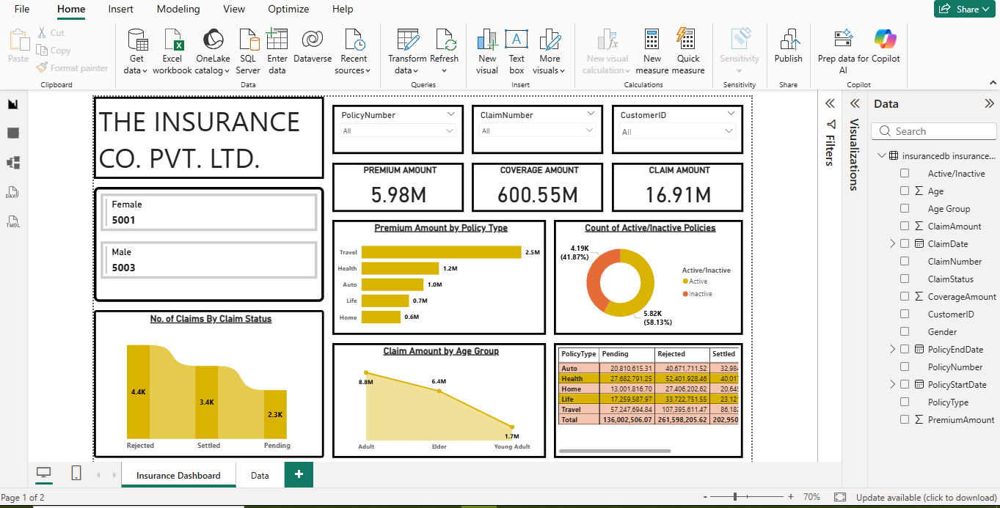
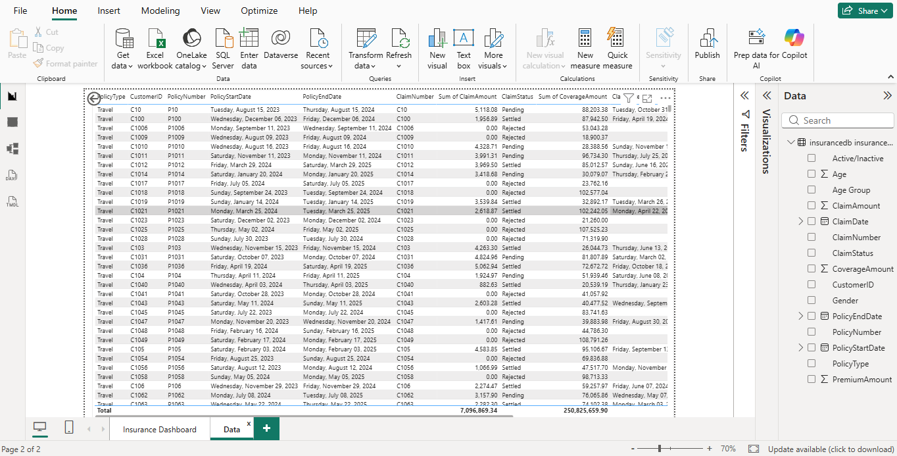

# Insurance Claims Analytics Dashboard

## Project Overview

This Power BI dashboard provides end-to-end analysis of insurance policies, premiums, claims, coverage amounts, and claim settlements. The dashboard helps identify claim trends, policy performance, customer demographics, and operational insights.

## Business Problem

Insurance companies need visibility into policy performance, claim patterns, settlement rates, and customer demographics to improve risk management and business profitability.

This dashboard enables stakeholders to monitor policy activity, claim outcomes, and premium performance through interactive visualizations.

## Tools & Technologies

* Power BI
* Power Query
* DAX
* SQL
* Excel
* Data Modeling
* Data Visualization

## Key Business KPIs

* Premium Amount: 5.98M
* Coverage Amount: 600.55M
* Claim Amount: 16.91M

## Dashboard Features

### Policy Analysis

* Active vs Inactive Policies
* Policy Type Distribution
* Premium Analysis by Policy Type

### Claims Analysis

* Claims by Status
* Pending Claims
* Settled Claims
* Rejected Claims

### Customer Analysis

* Gender Distribution
* Age Group Analysis
* Customer-wise Policy Tracking

### Financial Analysis

* Premium Amount Analysis
* Coverage Amount Analysis
* Claim Amount Analysis

## Key Insights

* Travel policies generated the highest premium contribution.
* Active policies account for the majority of policy records.
* Rejected claims represent the largest claim status category.
* Adult customers contribute the highest claim amount.
* Policy type significantly impacts premium and claim performance.

## Dashboard Screenshots

### Insurance Dashboard

### Claims Data View

## Repository Contents

* Insurance_Claims_Analytics_Dashboard.pbix
* Dashboard Screenshots
* Project Documentation

## Author

Shubhender Kumar

Senior Quality Analyst | Aspiring Data Analyst

Skills: SQL | Power BI | DAX | Python | Excel
